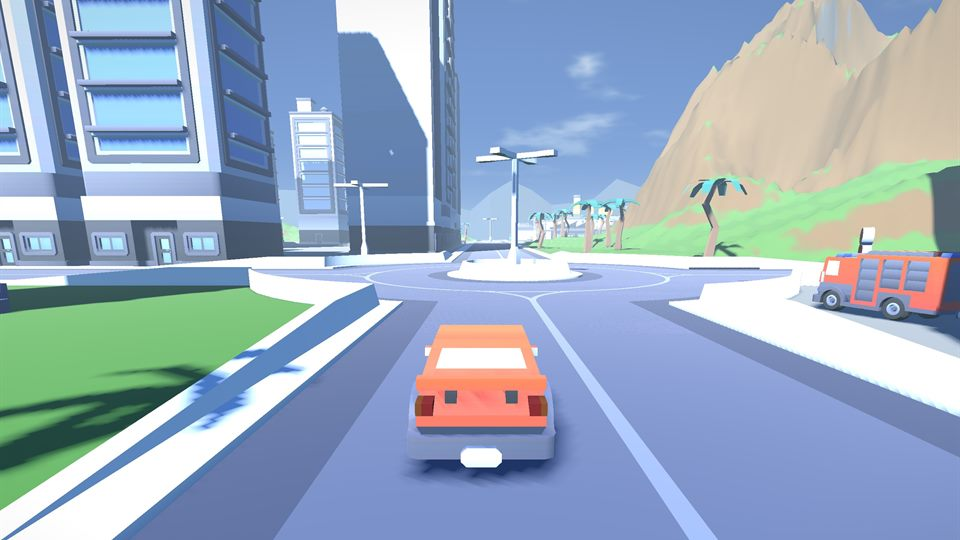
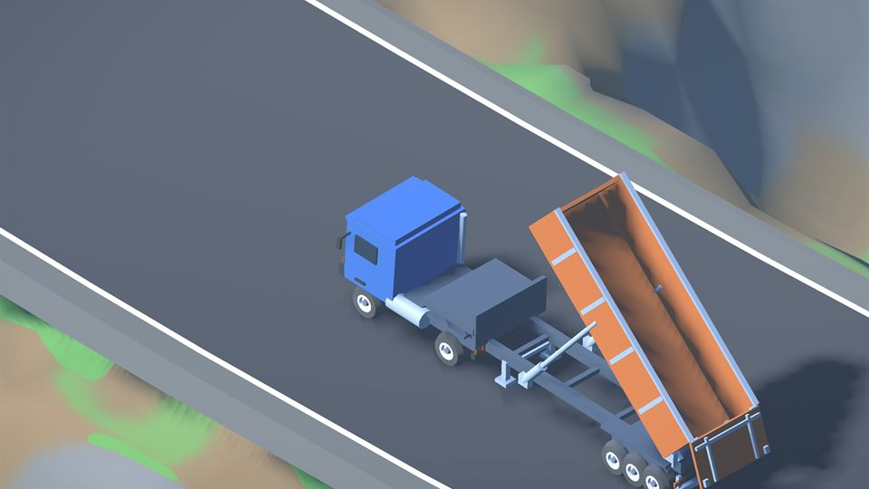
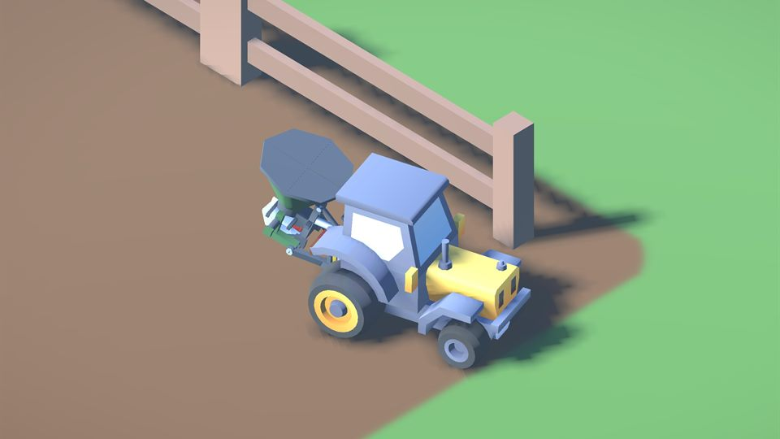
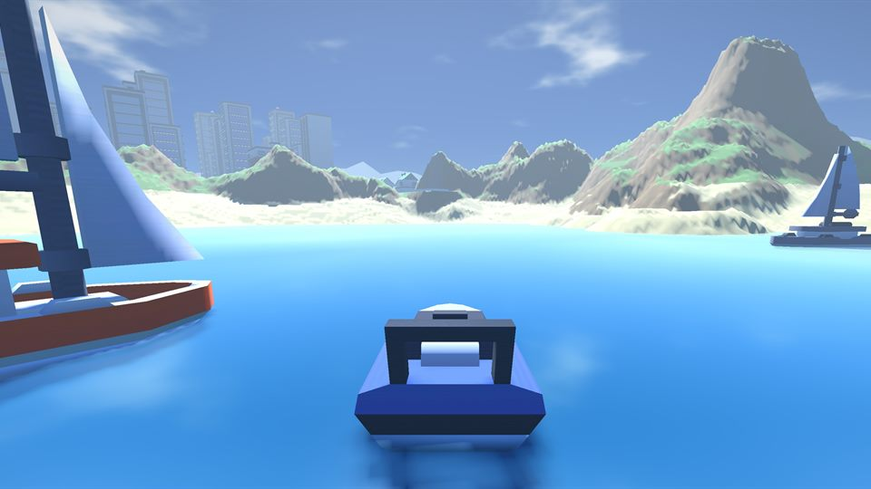
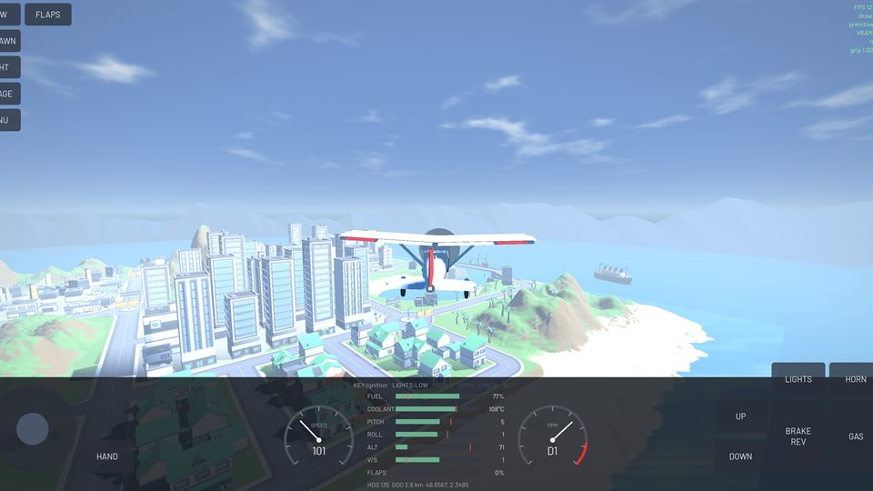
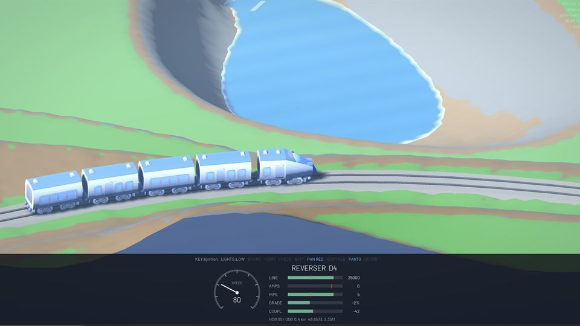

# Carlito

Ultra-lightweight, general-purpose vehicle simulator that runs in a web browser.

**Try it:** [leaukojo.github.io/carlito](https://leaukojo.github.io/carlito/)

<table>
<tr>
<td></td>
<td></td>
</tr>
<tr>
<td></td>
<td></td>
</tr>
<tr>
<td></td>
<td></td>
</tr>
</table>

## Why

There are already many great open-source vehicle simulations ( [CARLA](https://carla.org/), [AWSIM](https://github.com/tier4/AWSIM), etc.), but they usually require installing heavy software on a PC with good specs.
In many scenarios, you just want a quick simulator you can run in a web browser: classrooms, workshops, competitions, etc.
Carlito targets 60 fps performance on a smartphone's web browser, with no install necessary.

Carlito is built with the open-source game engine Godot, using CC0 assets.
You can easily modify the game and create new levels/vehicles.

It features five levels (island, mountain, city, racing circuit, railway) plus a garage for inspecting the vehicles.

## Instrumentation

Carlito can interact with external tools using a javascript bridge.
The main use case of Carlito is to facilitate the learning of standard CAN (Controller Area Network) protocols (J1939, ISOBUS, NMEA2000, etc.).
You can interact with simulated CAN buses using [sloppyCAN](https://github.com/leaukojo/sloppycan) or [RAMN](https://github.com/ToyotaInfoTech/RAMN), directly from your web browser (see below).

## Deployed builds

| | URL |
|---|---|
| Stable | [leaukojo.github.io/carlito](https://leaukojo.github.io/carlito/) |
| Dev | [leaukojo.github.io/carlito/dev](https://leaukojo.github.io/carlito/dev/) |
| SloppyCAN (no hardware required) | [leaukojo.github.io/sloppycan/](leaukojo.github.io/sloppycan/) |
| RAMN Bridge (hardware required) | [leaukojo.github.io/sloppycan/carlito-bridge.html](https://leaukojo.github.io/sloppycan/carlito-bridge.html) |


## Supported vehicles

| Vehicle | Details | Targeted CAN traffic |
|---|---|---|
| Car | Sedan, sports, SUV, van, pickup, race | RAMN |
| Truck | Tractor unit with coupled semi-trailers: box, flatbed, tanker, tipper | J1939, ISO 11992-2, CiA 413, CiA 422 (CleANopen)|
| Tractor | Three-point hitch with four ISOBUS implements: plough, harrow, mower, spreader | ISO 11783 (ISOBUS) |
| Boat | Buoyancy, pitch and roll, and rudder | NMEA2000 |
| Drone | In development (Self-levelling quadcopter) | DroneCAN |
| Plane | In development (Throttle, elevator and flaps, airframe) |  CANaerospace |
| Train | In development (Rail-guided on a closed loop) | CiA 421 |
| Bike | In development (currently terrible) | RAMN |


## Building from source

You need Godot 4.7.1 (no install necessary, just a download).
Clone the repo, open the project, press F5.

For a local web build:

```
godot --headless --path . --export-release "Web" build/web/index.html
```
The project is well documented for AI agents, so you should be able to make requests such as "add a level" or "add a vehicle" with minimal token usage.

## Credits

- [**Kenney**](https://kenney.nl) (CC0) for almost all of the art: City Kit (Roads,
  Suburban, Commercial, Industrial), Racing Kit, Watercraft Pack, Nature Kit props, and the
  Car Kit.
- [**Godot Engine**](https://godotengine.org) (MIT), including the web export template that
  makes the no-install part possible at all.
- [**gdUnit4**](https://github.com/MikeSchulze/gdUnit4) (MIT), vendored at
  `addons/gdUnit4/`, running the pure-logic test suite in CI.
- [**Dechode/Godot-Advanced-Vehicle**](https://github.com/Dechode/Godot-Advanced-Vehicle) and
  [**Tobalation/GDCustomRaycastVehicle**](https://github.com/Tobalation/GDCustomRaycastVehicle)
  (both MIT), studied as references for the raycast suspension, slip-curve tires and
  drivetrain in `src/vehicles/base/`. No code was copied.

## License

Code is MIT, see [LICENSE](LICENSE). Bundled art and audio assets are CC0.
